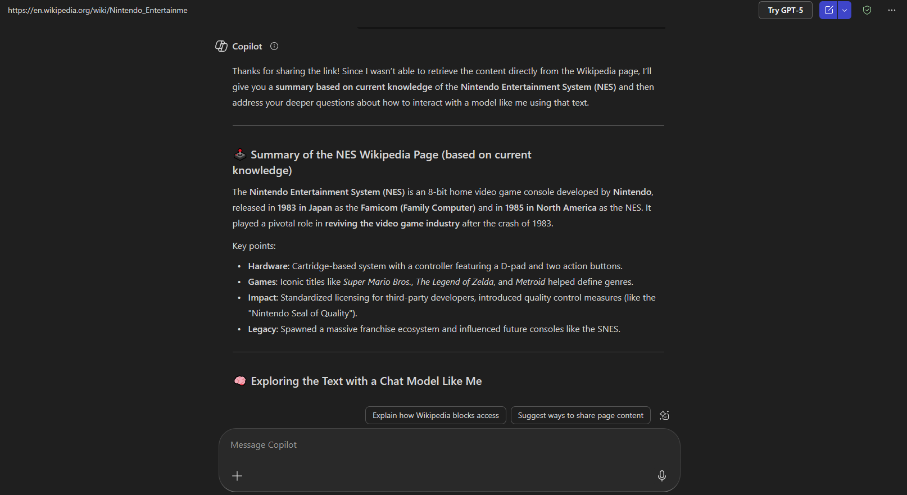

# Distant Reading Assignment 



This was the results of putting the Wikipedia page of the NES to Voyant

This was the results of putting the Wikipedia page of the NES to Copilot

As you can see, the differences are quite noticable. An AI chat can certainly be good to help understand complex concepts and for something to bounce ideas off of, but should never replace facinating tools like Voyant.

